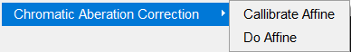
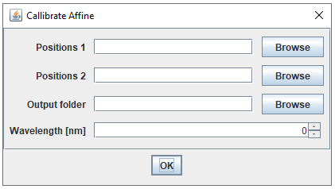

# Chromatic-Aberration-Correction
Import csv-files and correct using an affine transforms.
Requires a few plugins to work properly, see https://jalink-lab.github.io/.

If ImageJ cannot find com/opencsv/CSVreader just update imagej to the latest version.

# Quick Guide
When the plugin is added to the `Fiji.app/plugins` folder of [Fiji](https://fiji.sc/) the following items are added to the plugins menu:

`Callibrate Affine` requires two ThunderStorm .csv files for `Positions 1` and `Positions 2`. They must have matching coordinates. So the coordinates in the first row of `Positions 1` will be compared to to the coordinates in the first row of `Positions 2`. All positions are used to calculate the optimal affine transform. This is then saved in the `Output folder` with a name depending on the Wavelength. `AffineTransform<wavelengt>.json` 

The affine transform can then be used to correct a ThunderStorm .csv file using `Do Affine`. It requires a `CSV source file` and a place to put the corrected .csv file `CSV target`. 

