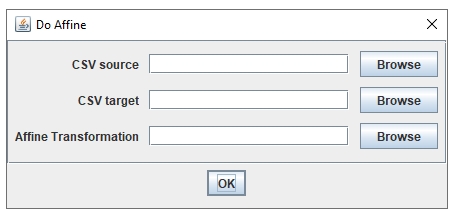

# Chromatic-Aberration-Correction
Import csv-files and correct using an affine transforms.
Requires a few plugins to work properly, see https://jalink-lab.github.io/.

If ImageJ cannot find com/opencsv/CSVreader just update imagej to the latest version.

# Quick Guide
When the [plugin](https://github.com/Jalink-lab/Chromatic-Aberration-Correction/releases) is added to the `Fiji.app/plugins` folder of [Fiji](https://fiji.sc/) the following items are added to the plugins menu:

`Callibrate Affine` requires two `.csv` files for `Positions 1` and `Positions 2`. They must each have at least two columns with `x [nm]` and `y [nm]`in the header, with matching coordinates for the two wavelengths (The coordinates in the first row of `Positions 1` will be compared to to the coordinates in the first row of `Positions 2`.) All positions are used to calculate the optimal affine transform matrix. This is then saved in the `Output folder` with a name depending on the Wavelength. `AffineTransform<wavelengt>.json`

To create the required `.csv` files with positions images with multi-colored beads can be used. Make sure that coordinates of all the beads are detected for all colors. A way of achieving this is as follows:
- Measure beads in three colors sequentially (single or (better) many frames) at multiple locations in the sample to create a field with many beads
- Run ThunderSTORM on all of them. The output `.csv` files will hold the detected coordinates. Most probably not all beads are detected in all frames, creating mismatches.
- Concatenate the `.csv` output files per color using ThunderSTORM, and re-save. You should now have three `.csv` files (for three wavelengths).
- Create superresolved images (with 5 or 10 nm pixels)
- Detect the bead positions using [this macro](https://github.com/Jalink-lab/Chromatic-Aberration-Correction/blob/master/ChromCorr_retrieve_3ch_beads_coords_from_image.ijm). The output `.csv` files can be fed into the Chromatic Aberration Correction plugin to generate the affine transform matrices.

The affine transform can then be used to correct a ThunderStorm .csv file using `Do Affine`. It requires a `CSV source file` and a place to put the corrected .csv file `CSV target`. 

